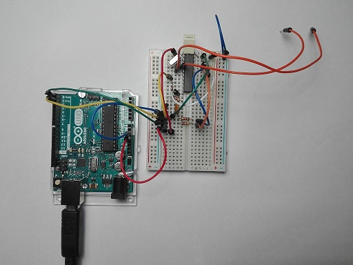

Frequency counter
=================
This is a cheap and simple but powerful frequency counter capable 
of measurements of frequency with 8 digits of precision every second
(9 digits of precision in 10 second averages).

This frequency counter is based on a little **PIC 16F18446** a 
16x2 LCD display, and USB-Serial interface with PC.

All the programs and hardware designs are free, open source and
open hardware.

The frequency counter have a Command Line Interface via serial 
communications for manage multiple internal options. 
You can read more in [Command Line Interface help](docs/commands.md)

You can mount the frequency counter over a breadboard with this simple 
[schematic](breadboard/kicad/freqcounter_16F18446.pdf)
with a cost of few dollars.
The LDC display is optional. All the info is sended via serial.

Specifications
--------------
* Input frequency range: 0.01 Hz to 15MHz
* Resolution: 8 digits per second (10ns of resolution) at all frequencies.
* Precision: 0.1PPM with simple crystal and calibration.
* Number of inputs: 2 TTL inputs + 1 Zero Cross Detection input
* Output: Frequency or Period, time and pulses counted.
* Phase delay: between 2 inputs with 10ns of resolution.
* Gate times: 1 second and 0.1 seconds.
* Output: via LCD and serial UART.
* Autocalibration: with 1PPS signal or with 10MHz signal.
* Reciprocal counting: allow calculate lower frequencies with decimals.
* Continuous timestamp: allow frequency averages without error.
* Frequency autorange from Mega Hertz to milli Hertz.
* Adaptable system frequency without reprogramming (8MHz internal or 5MHz external)
* Command Line Interface: via USB-serial communications for configuring options.
* Input levels: between 0.8v (LOW) and 3.1V (HIGH).
* Power Supply: 5 volts.
* DIY: you can mount it with a breadboard and one crystal oscillator.

Images
------
Example of frequency meter conected to an Arduino.
Arduino gives power and serial communications with PC.

Orange cables are the 2 TTL inputs.

[Full image](images/IMG_20200427_143115.jpg)

Licenses
--------

* Creative Commons Atribution-ShareAlike version 4, for hardware designs,
  texts, photograps, layouts, schematics, and similar.

* GNU General Public License version 3, for microcontroller 
  and computer programs.

